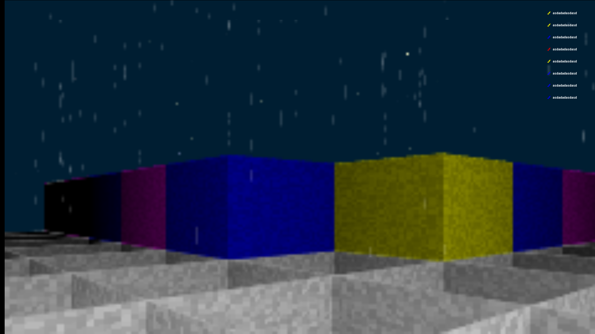

# Broken Memories

Contributed during the Global Game Jam 2020

 
You are in the head of this human now. It's on you to repair all the memories and reveal the
                        forgotten words!

                        

Rules:

<ul>
    <li>Reveal the word to complete a game</li>
    <li>Colorize all walls to reveal the word</li>
    <li>The word is displayed on the map, hit x to open the map</li>
</ul>

Controls:

<ul>
    <li>W A S D - Walk</li>
    <li>Mousewheel spin and look</li>
    <li>Left click - Paint a wall</li>
    <li>X - open the map</li>
    <li>Space - Open prompt to enter the answer</li>
</ul>

## Resources used for this engine

This game is created with Meteor, The fastest way to build Javascript apps: https://www.meteor.com/

Tutorials used:

http://www.playfuljs.com/a-first-person-engine-in-265-lines/

https://dev.opera.com/articles/3d-games-with-canvas-and-raycasting-part-1/

https://permadi.com/1996/05/ray-casting-tutorial-table-of-contents/

## Engine

Built with `raycaster2` engine: https://github.com/jankapunkt/js-raycaster-engine

## Assets

All assets are under CC License. Please see the [assets folder](./game/public/assets) for the licenses and credits.

## License

As all GGJ games are licensed under creative commons, this one is also licensed under a Creative Commons Attribution-NonCommercial-ShareAlike 4.0 International License.
See License file.